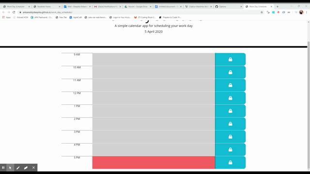

## work_day_scheduler

Created a simple calendar application that allows the user to save events for each hour of the day.

## Criteria

User needs a daily planner to create a schedule
Current day is displayed at the top of the calendar
When user scroll down, user is presented with timeblocks for standard business hours
When user click into a timeblock
Then user can enter an event
And should be able to save the event.
When user refresh the page
Then the saved events persist.

## To achive the above criteria

1. Created rows and coloumns for Time blocks using Jquery and Bootstrap.
2. Declared Rowinfo class to store row info.
3. Created an array of months to set date.
4. Created if condition to Color the events.
5. Used local storage to store the event data.

Application Link:  https://ankareddydeepika.github.io/work_day_scheduler/

